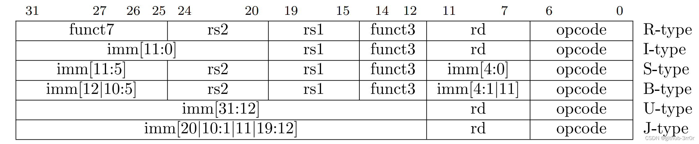
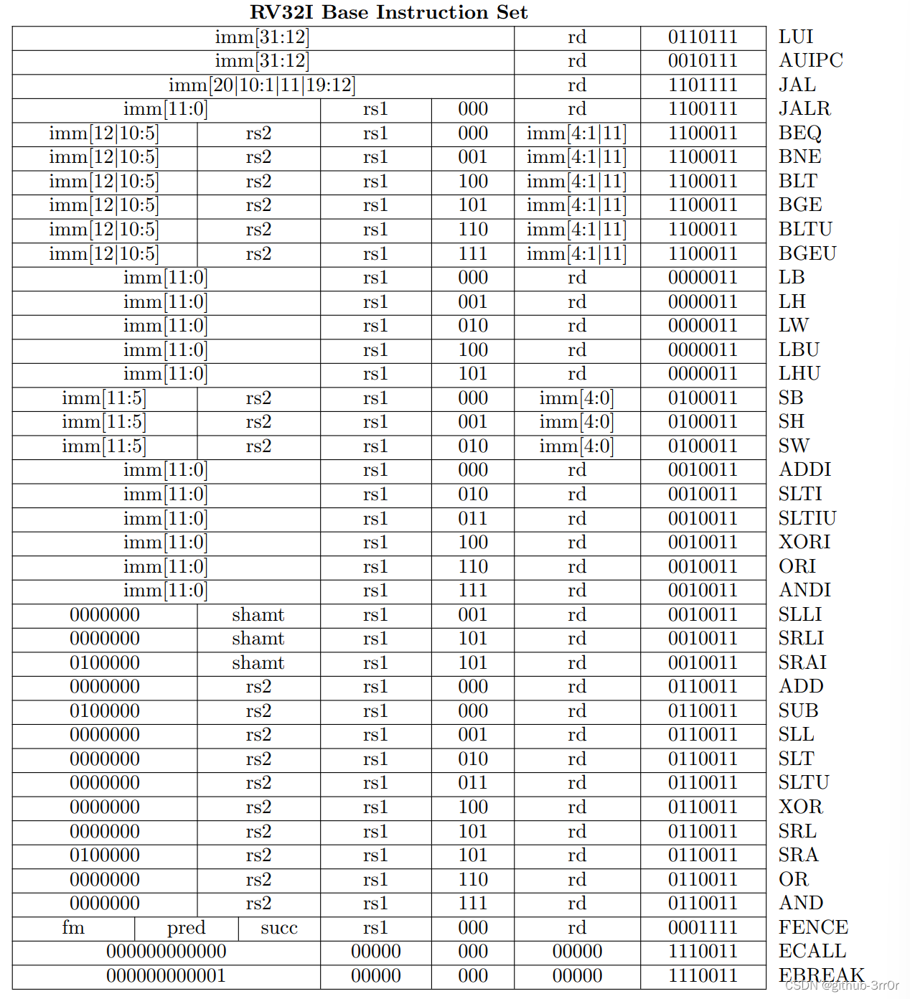
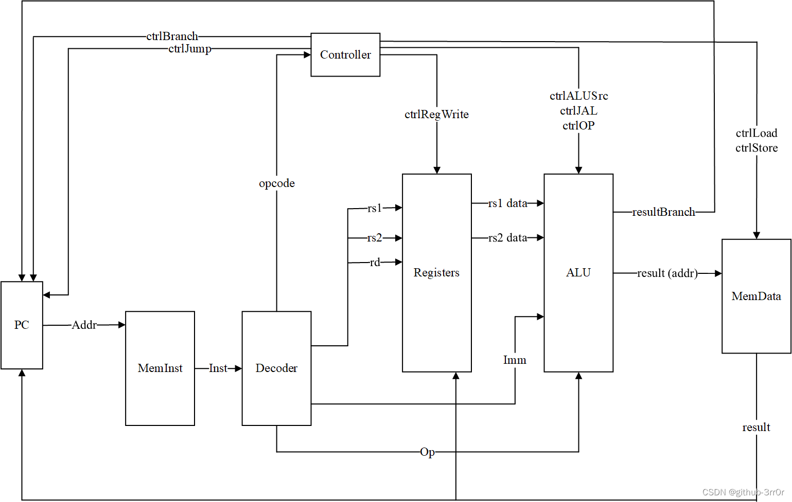

# 单周期 RISC-V 处理器设计实现

## 1 需求分析

+ [x] 指令集：支持 RV32I 基本指令集，然后就没了
+ [ ] 内存层级：直接读取内存，不支持 Cache
+ [ ] 虚实地址转换：直接读取内存，没有转换
+ [ ] 指令集并行（ILP）：没有流水线，没有多发射也没有指令集并行
+ [ ] 数据级并行（DLP）：不支持向量拓展
+ [ ] 线程级并行（TLP）：单核CPU，不支持多线程，不存在贡献内存，不用考虑复杂的内存一致性问题

## 2 设计方案

### 2.1 指令设计

RV32I 共有六种类型：

RV32I 中的所有指令，共计四十条：

按照指令的功能对指令进行分类：
1. 直接跳转类：包括JAL和JALR；
2. 条件分支类：包括BEQ、BNE、BLT、BGE、BLTU、BGEU；
3. 加载 / 存储类：包括LB、LH、LW、LBU、LHU、SB、SH、SW；
4. 算术逻辑运算和位运算类：包括所有加法、减法，按位与、或、异或，逻辑左移、逻辑右移、算术右移相关指令；
5. 比较指令类：包括SLTI、SLTIU、SLT、SLTU；
6. 其他指令类：FENCE、ECALL、EBREAK；

再依次对这几个类指令的行为进行分析：
1. 直接跳转类需要对 PC 寄存器的值进行直接修改，同时写一个寄存器；
2. 条件分支类首先需要进行比较，然后根据比较结果选择是否修改 PC 寄存器；
3. 加载 / 存储类需要访问数据存储，加载只读取数据，存储只写入数据；
4. 算术逻辑运算和位运算类会对操作数进行运算，然后将结果写入目的寄存器；
5. 比较指令类与算术逻辑运算和位运算类一致，但操作变成了比较；
6. 其他指令中，由于不需要维护内存一致性和连续性，因此我们不需要实现FENCE，同样，由于不涉及环境调用中断和调试调试中断，所以我们暂时也不需要实现ECALL和EBREAK；

### 2.2 数据通路设计

CPU 中应该至少需要包含以下**数据通路**组件：
1. 指令内存（MemInst）：接收一个 32 位的指令地址，读取出指令；
2. PC 寄存器（PCReg）：为指令内存提供指令地址，每个时钟周期地址都会 + 4，当前指令为跳转时，下一条指令为跳转目的地址，当前指令为分支指令且分支成功时，下一条指令为分支目标地址；
3. 通用寄存器堆（Registers）：可读可写的寄存器，接收寄存器号，为运算单元提供操作数，接收运算结果或从数据内存读取到的值；
4. 数据内存（MemData）：根据加载 / 存储地址，加载或存储数据，加载或存储依赖于译码器的译码；
5. 指令译码器（Decoder）：对指令进行译码，解析得到立即数、操作码、寄存器号等信息；
6. 运算单元（ALU）：根据操作数和操作码进行运算，运算结果写到寄存器，分支指令时将比较结果发送给 PC，加载存储指令时计算地址；

### 2.3 控制逻辑设计

**控制逻辑**需要根据译码结果对数据通路进行控制，控制信号的生成和传输我们统一由控制器（Controller）完成，可能需要以下几个方面：

1. ctrlJump：指令是否为跳转指令？如果是，需要给控制信号到 PC，要求在下一时钟周期修改为跳转目的地址；
2. ctrlBranch：指令是否为分支指令？如果是，根据运算单元的比较结果（分支与否），决定是否让 PC 在下一个时钟周期跳转的分支目标地址；
3. ctrlRegWrite：指令是否需要写寄存器？如果是，将运算单元的结果或从数据内存中读取的值写入寄存器；
4. ctrlLoad：指令是否为加载指令？如果是，写入寄存器的值来源应该是数据内存；
5. ctrlStore：指令是否为存储指令？如果是，将寄存器中的值写入数据内存；
6. ctrlALUSrc：指令的操作数 2 是立即数还是寄存器值？根据此选择操作数 2 的值；
7. ctrlJAL：指令是否为 JAL 指令？如果是，操作数 1 的值应当为 PC 寄存器的值；
8. ctrlOP：为 ALU 指定具体的操作，加？减？或者其他啥？

### 2.4 现有设计草图

草图：

## 参考资料

> [Chisel 实战之单周期 RISC-V 处理器实现](https://blog.csdn.net/weixin_43681766/article/details/128361357)